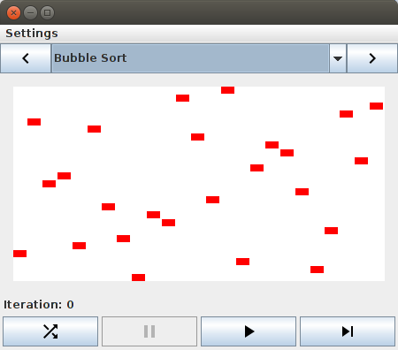

# Sorting Algorithm Viewer
This Java GUI application visualizes various sorting algorithms. You must have [Java 8](http://www.oracle.com/technetwork/java/javase/overview/java8-2100321.html) or later.

# Developers
Documentation for developers is described in [/doc/README.md](./doc/README.md).
