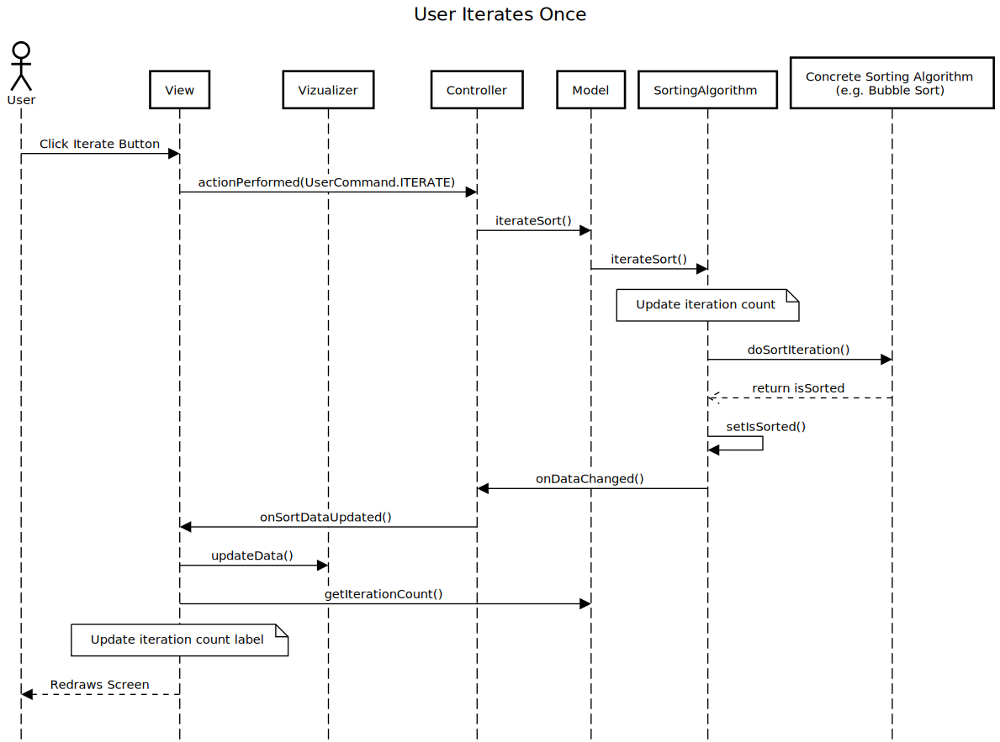
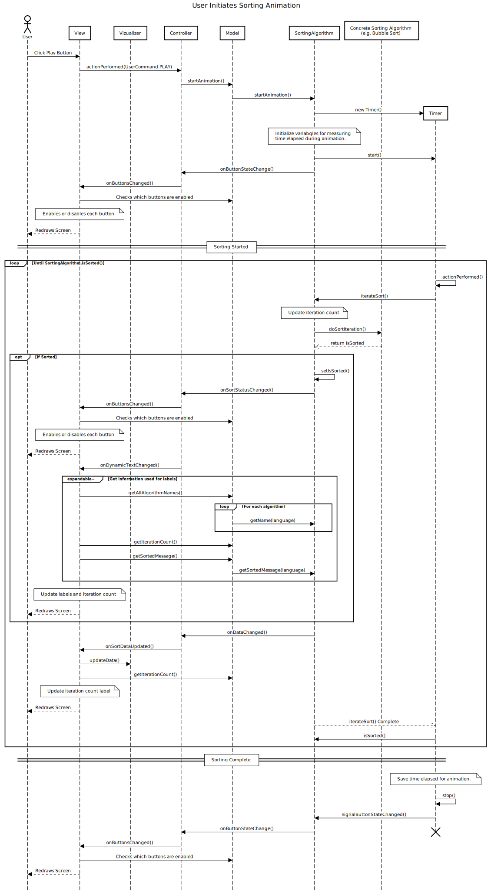

# How to generate sequence diagrams
The following sequence diagrams were created using [SequenceDiagram.org](http://sequencediagram.org/), and you can use this website to create your own sequence diagrams.

## Sequence Diagram for the User Clicking Iterate
The sequence diagram below shows the interactions between the objects when a user clicks the iterate button. The iterate button causes the sorting algorithm to perform a single iteration. The user can click this button repeatedly until the data is sorted.

The [`UserIteratesOnce.txt`](./UserIteratesOnce.txt) file contains the steps that can be pasted in the [SequenceDiagram.org](http://sequencediagram.org/) online tool to generate the diagram. You can also see the diagram directly in the [online editor](http://sequencediagram.org/index.html#initialData=C4S2BsFMAIFUGdICdoEljIIYftA8gHYDGkAUKZkcAPYoLKkAOmSoRIzBw0AaiJAHcmLNh0xdeIAF4BXTOGkNmrEO07cAwtS5Jq4KEmEq147gFlqAE0jgjo9dABEAemcBlWqAIBzAILhvWjAACwBbV0doTFwPFR9-QKQQ0LtVMQlHLWIkSAxoWK9vaASg4DCAHQIACkgAOm9a6AAhGQAjVqh8zwBKSOjmto7IAvJSeiQAWgA+PkEALg0FIgBrNAwkbBgW4BoCUlmBaazgXX1kOcpQbQAFZAAzWlDISyrxrVDQ8Uta1AAVAFEAEq+AHdUjHU4GaYWazgOZgLAYApVMEwmzTAogeIBUpheHrTbIsEEah5agAN2QXTifhxSTKoTmsEYlk20ARGyuBGgRGoMi4pEx2MSyWmLXaUAKc0s1AK6ERIG0KMFnixtJFDIAPJqJhNxUMpTlgDIkNyQPACs8VTSSvSwhjVcLcYzEMBUBbPM9lRC9AYdUL1c65toACLYTAaYLibxesEHHU+s5IYMEAph4CYZmsjAvOP8Q4zaRyBRSc4yFmbdOYZUHaFWGxzGNuglcrT84DKklkykoA5Mit5DnYRXc3nt6DgTCtGxjRBIHUTPuA54bAQxIg5SB7UhAA).

:heavy_exclamation_mark: **NOTE**: For this assignment, the sequence diagrams that you will need to generate should have a similar level of complexity (detail) as the diagram below.

## Sequence Diagram for the User Initiating the Sorting Animation
The sequence diagram below shows the interactions between objects when the user initiates the sorting animation.

The [`UserInitiatesSortingAnimation.txt`](./UserInitiatesSortingAnimation.txt) file contains the steps that can be pasted in the [SequenceDiagram.org](http://sequencediagram.org/) online tool to generate the diagram. You can also see the diagram directly in the [online editor](http://sequencediagram.org/index.html#initialData=C4S2BsFMAIFUGdICdoEkB2YQENiXtAMoD2So6A5tAIKYC2uIx6AUC9gMbClyJIsAHbGRAcQQ9MGgA1EJADug4aDESpsgF4BXbOBAbkSkauyToAYWbAkxcFH5Dj401ICyxACaRwRlc7MARAD0QSQilNTgFKRgABZ0IQHQ2ARh5BSR0UhxdL6i-lIBlugcSJB4RKTpNFExwPEAOugAFJAAdBRt0ABCWgBGfVCVZACUSSk9-YOQaXkmZgAqIHSGbAjIALQAfLIKAFzmehwA1tAACuDYAJ6TwNysu-Lbxda29nucoMxnyABmpCsPM11khLHQGOgPG0zgAZagATRGLBeNjsmy27i84D28GAyloy0YzGaSMx3m2aRAEVq2XqdBxeLIBIYXxaSMp1KyOW2AColiskHt0ApoPzkCS2OhiBViAA3ZDDdKZOrxPYYLC6fQwWXCHB9ACOUAI-xQKxSWmylCaoBW0G82AEiA80A8FqpVFMhNZbTYHIyNO5WzFgtxyglKLeyAAPBs-craarmL07sxCHi8OZYqYKJAJY8YxG0YKk1oU+h4Jns5AgUjHtsydjM5ATgR5LFRLFoH1S-cCMIYJB0Nhph4WFKZfKUI89gBRIfTAg8DwgeDDo12zid7tllh17YgvbQABK1aQ2HkqVKkEHLAAvLe-URGXgPPeWN5EIrqyxwMRiAI4EkEBwEVd14xyNoVzSasJWDbZg0PT4mHQH4kBNQFYOWdE4wDOlDzAZBcBmKoJTHaUYDlBUcK5PDYAEDwiOgAiz1ZaAOGILRJBYaiVTobZegGKA0j2DxiDSVA8BY5CJR4hM6CjGMNgE6ZhLKYALXQJj4Gg0d-ykVBfi-UdZMDEy8MQYBUG0qoYKRQt7BjMzE3QNI01wLQKyzShbN3OR5ALKxUXeEsy08qsa18hR608bwDliZtjlbdsOC3HtmD7Mo7XnKBR3HCjJxkPzZ2y-BoCXFc11KyBNy7NKHj8jZ9z4Q8Tw8M8LyIK8b3zDZ7OQPZmAAESuIc6FEBZIAAD2AStvIiqaJAY6ZACQiaAAHFyiY9B0KJTSPOraATWgS4+g-SKngxGLsRzYBInAcC6QAOWwFZ4AlX9-2gAAxHhqpS5JcPiFgGwpKowMB+kbuelZmkuSgdBzJFB1HOtLqxPYbokwjWUsTjgDzBq0dim6dNcfBVxzCUQa2JzIfKUnyewSm4YoBHICRyEyInBVpzohiKhOj9kkhJjJN2tiOK4vctgPY9T3PS8yhvZHkUCyMkEcsHOV4gb0EG3BsFmnMIp6vrixcqp9bxPmiJNwnNB0PQDEFLR6KIq3sAJqKieu8osak5hcckCU8rKgrebdipmPF9i8eO4dvBYEFFOnVr2sV69WFpxqtiDLDBWjvA0hJCxiDoAQoDwbitf9Gj4hjBCoJs+bObvB8a9L8vK8gN9Q8olAEMIbB5WgG0B0uR0DqOz0WWQn04LzgUGX-GSa4e+uNgQ+AQAoIdwGTe43IzLzjdIs3NfCWudZCw-00gI3cyRLxcRsG5g3OgLJCC-qb-Sh+7e9g2OKCUkodlqqFZImVByVRRg1Jq-U5ZtQVp1JWrAgA).

:heavy_exclamation_mark: **NOTE**: This diagram is very complex compared to the sequence diagram you will need to generate for this assignment.

